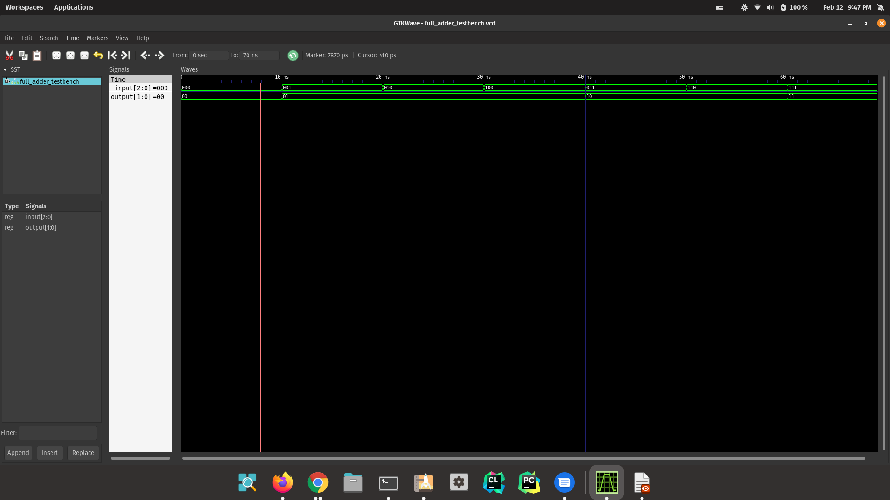

# Citations: 

1. L. Võsandi, “Using GHDL to simulate VHDL,” Lauri's blog, 16-Oct-2014. [Online]. Available: https://lauri.xn--vsandi-pxa.com/hdl/ghdl.html. [Accessed: 13-Feb-2022]. 
2. L. Võsandi, “Using gtkwave to analyze waveforms,” Lauri's blog. [Online]. Available: https://lauri.xn--vsandi-pxa.com/hdl/gtkwave.html. [Accessed: 13-Feb-2022]. 

# Compilation Instructions. Run the following quoted commands in a terminal
## All instructions performed on Ubuntu 21.10 (More Specifically Pop!_OS) 

`ghdl-gcc -a full_adder.vhd`  
*Outputs a full_adder binary*  
`ghdl-gcc -a full_adder_testbench.vhd`  
*Outputs a full_adder_testbench binary*  
`ghdl-gcc -e full_adder_testbench`  
*Outpus a linked binary*  
`./full_adder_testbench --vcd=full_adder_testbench.vcd`  
 
**To load into gtkwave with file**  
`gtkwave full_adder_testbench.vcd`

