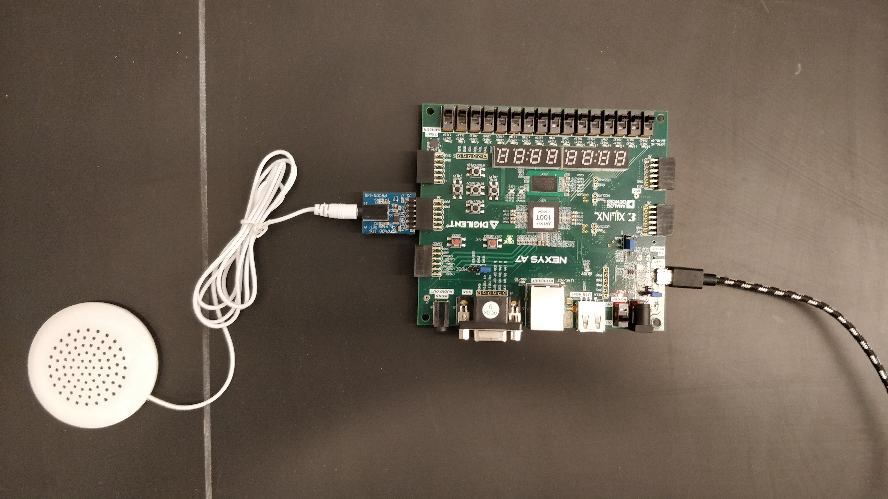
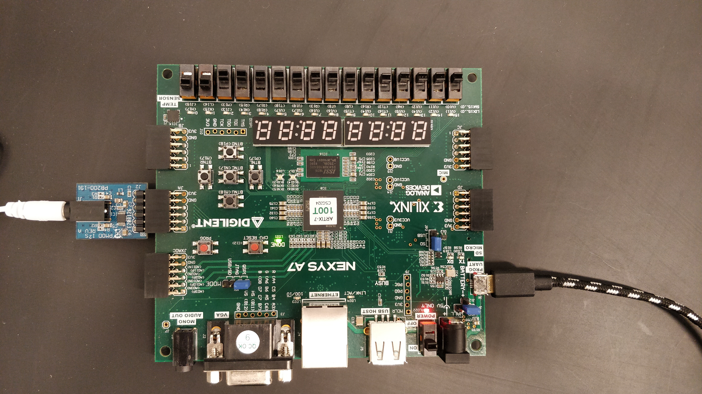

# Assignment 7: Vivado Lab 5
## All vhd and constraint files in .srcs folder of respective project
### Warning: All Audio is very quiet

#### Lab 5 Part 1: Siren
- Code
	- Created a new project in Vivado called `siren`
	- Followed the instructions from [Lab 5](https://github.com/kevinwlu/dsd/tree/master/Nexys-A7/Lab-5) to set up the Vivado project
	- Using code provided, edited the Design Sources and Constraints of the project
	- Ran synthesis and implementation
  	- Then generated bitstream
	- Programmed the Nexys A7-100T board with the generated `siren.bit` file

- Usage
	- Plug wail module into Nexys A7-100T board
	- Module will start playing a tone with a clock rate of 48Hz
	
		https://user-images.githubusercontent.com/40646481/163020823-16e68d06-0a88-4090-92cb-a1fca93877a1.mov
		
		

#### Lab 5 Part 2: Siren modifications
- Code
  	- Created project called siren_modifications
	- Similar steps from Part 1, but source and constraint files are from [modifcations subfolder](https://github.com/kevinwlu/dsd/tree/master/Nexys-A7/Lab-5/Modifications)
	- Used code from respective project, but with the aforementioned procedure
	- Programmed the Nexys A7-100T board with the generated `siren_1.bit` file
-  Usage
	- Same procedure for playing tone as before
	- Use switches to modify frequency
		
	https://user-images.githubusercontent.com/40646481/163021475-a0d877f4-03a0-422c-9f6d-5dd050099adf.mov
		
	
